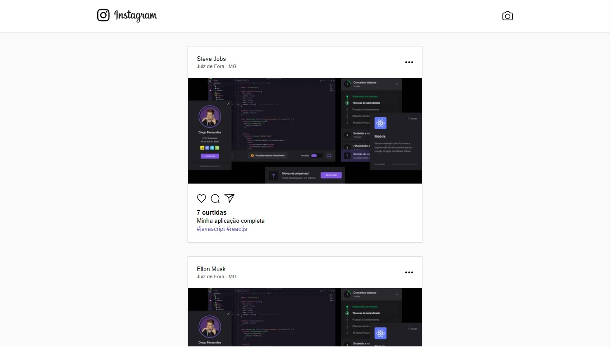

<h1 align="center">Semana Omnistack 7</h1>

Projeto desenvolvido na semana OmniStack 7.0 da Rocketseat.

## Sobre o projeto

A ideia do projeto é criar um aplicativo semelhante ao do Instagram, usando a stack Node.js e ReactJS .

## Funcionalidades

- Criação de Posts
- Listar todos os Posts
- Posts podem receber Likes

  

